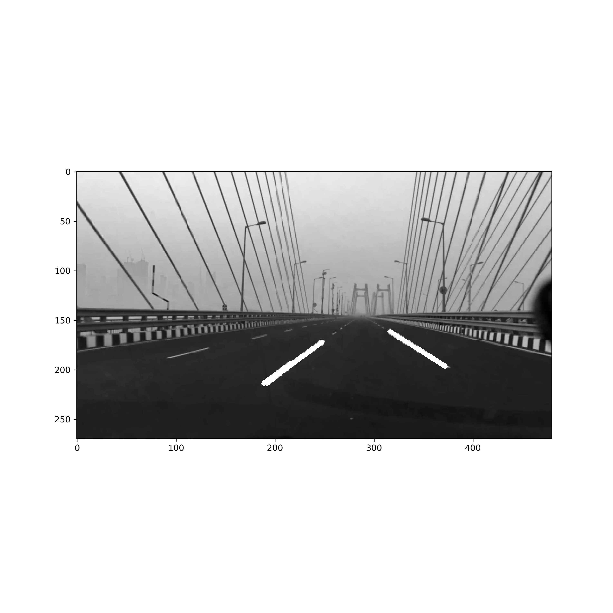

# Lane Detection v1

V1 : 기본적인 Lane Detection (차선 탐지) 알고리즘을 구현한 버전

V1의 문제점
차선탐지를 이용해서 자율주행을 할 때는, 아래와 같이 동작함
1) 양쪽의 차선을 탐지
2) 양 차선증 동일한 높이에서 (이미지의 height에서 동일한 위치) 가로로 직선을 긋고, 그 중에서 중심을 찾고
3) 화면 최 하단에서 중간점을 고른다. (= 내 차량의 위치)
4) 2)와 3)에서 각각 계산한 중간점이 일치하면 정상적으로 주행하고 있는 것이고, 그렇지 않으면 차선의 중간에서 내 차량이 약간 벗어났다는 것이다. 이를 기준으로 오른쪽 또는 왼쪽으로 약간 틀어주면 차선의 중심에서 주행을 할 수 있다.

Hough Line Transform (probabilistic version)을 사용하면, 다음과 같은 문제가 발생할 수 있다.
왼쪽 차선은 상단부만 검출
오른 차선은 하단부만 검출.
이 경우, 동일한 height 에서 왼 차선과 오른 차선을 직선으로 연결하는 선을 그릴 수 없게 되는 경우가 발생한다.
또한, 한쪽 차선 또는 모든 차선이 탐지되지 않는 경우가 발생할 수 있다.

이러한 문제를 개선하기 위해, 앞으로 차선탐지 알고리즘 v2, v3...을 만들것임.

참고: 몇장의 사진에서 Type Error가 발생하는데... 이유는??

# Lane Detection v2

TODO:
차선이 탐지되지 않는 경우 (한쪽 또는 양쪽 모두), 이전에 탐지한 차선을 재사용 하는 것으로 설정
차선탐지를 시작한 이후로 한번도 탐지되지 않으면, 이전에 탐지한 차선이 없어서 재사용 할 수가 없으므로, 이 경우에는 Frame Mask를 이전에 탐지한 차선으로 가정하고 사용한다.

아직, 양 차선의 중심과, 내 차량의 중심을 계산하는 것은 구현하지 말기 (v3 에서 구현)
오랫동안 차선이 탐지되지 않으면, 결국 잘못된 운전을 할 수 있는데, 그건 어떻하나...?

# Lane Detection v3

TODO:
(이제는 어떤 경우에도 양쪽 차선을 찾을 수 있다. 최악의 경우 Frame Mask를 쓰면 되니까...)
Hough Transform을 쓰면 차선의 일부만 찾을 수 있는 단점이 있는데, 이를 개선하기 위해서 numpy polyfit을 이용해서, 차선을 이어서 그리는 것으로 수정
v3에서는 ax+b 로만 fitting

탐지한 차선의 중심과, 내 차량의 중심이 얼마나 차이가 나는지도 화면에 출력하자

# Lane Detection v4

TODO:
v3를 개선해서 polyfit, degree=2로 fitting 하기 (ax^2+bx+c)
Degree가 2보다 커지는건 큰 의미가 없다고 생각함
Degree=2로 fitting 할때, Hough Transf이 찾은 선에서 추가로 많은 점을 sampling 한 후, fitting을 해야지, 안그러면 degree=2 fitting 결과가 이상하게 나오는 경우가 종종 발생한다.

# Lane Detection v5

TODO: 로로로로후후후후

