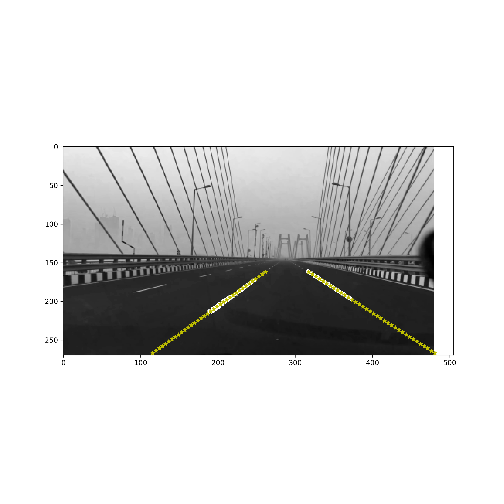

# Lane Detection v1

V1 : 기본적인 Lane Detection (차선 탐지) 알고리즘을 구현한 버전(Hough Line Detection, prob) // 참고: 온라인에서 찾은 tutorial을 기반으로 구현함. Tutorial 주소는 v1 노트북에서 확인할 수 있음.

차선탐지를 이용해서 자율주행을 할 때, 일반적으로 아래와 같이 동작함
1) 양쪽의 차선을 탐지
2) 양 차선증 동일한 높이에서 (이미지의 height에서 동일한 위치) 가로로 직선을 긋고, 그 중에서 중심을 찾고
3) 화면 최 하단에서 중간점을 고른다. (= 내 차량의 위치)
4) 2)와 3)에서 각각 계산한 중간점이 일치하면 정상적으로 주행하고 있는 것이고, 그렇지 않으면 차선의 중간에서 내 차량이 약간 벗어났다는 것이다. 이를 기준으로 오른쪽 또는 왼쪽으로 약간 틀어주면 차선의 중심에서 주행을 할 수 있다.

[v1의 문제점] Hough Line Transform (probabilistic version)을 사용하면, 다음과 같은 문제가 발생할 수 있다.
* 왼쪽 차선은 상단부만 검출
* 오른 차선은 하단부만 검출.
* 이 경우, 동일한 height 에서 왼 차선과 오른 차선을 직선으로 연결하는 선을 그릴 수 없게 되는 경우가 발생한다.
* 또한, 한쪽 차선 또는 모든 차선이 탐지되지 않는 경우가 발생할 수 있다.

이러한 문제를 개선하기 위해, 앞으로 차선탐지 알고리즘 v2, v3...을 만들것임.

TODO: 몇장의 사진에서 Type Error가 발생하는데... 이유는??

# Lane Detection v2

Hough Tranf 으로 탐지한 차선에다가 poly fitting (1-d, ax+b)을 해서 차선이 화면 가장 아래에서 부터, 화면 중간 정도까지 이어지도록 만들었음.

TODO: 
* 노트북에 보면 Error (left) 또는 Error (right) 라는 출력 메시지가 있는데, 이 부분은 해당 차선이 탐지되지 않아서 오류가 발생한 것이다. Hough 가 차선을 아예 탐지하지 못하면 poly fitting은 동작하지 않는다=> 여기를 고치자!!
* poly fitting 하면, 이 과정에서 시간이 너무 많이 소요 될 수 있다. 이 부분도 꼭 확인하자

# Lane Detection v3
v2랑 알고리즘은 동일

TODO: 차선 탐지 알고리즘 개선
* 차선이 탐지되지 않는 경우 (한쪽 또는 양쪽 모두), 이전에 탐지한 차선을 재사용 하는 것으로 구현
  * 차선탐지를 시작한 이후로 한번도 탐지되지 않으면, 이전에 탐지한 차선이 없어서 재사용 할 수가 없으므로, 이 경우에는 Frame Mask를 이전에 탐지한 차선으로 가정하고 사용한다.
  * 너무 오랫동안 차선이 탐지되지 않으면, 옛날에 탐지한 차선을 계속 하용할텐데? TTL(time to live) 개념을 적용해서, 차선이 탐지 안되면, 직전에 탐지한 차선을 쓰되, 시간이 지나면 서서히 Frame Mask 쪽으로 옮겨 가도록 구현하자.
* 양 차선의 중심과, 내 차량의 중심을 계산하여 얼마나 벗어나 있는지 체크
  * 양 차선의 중심 : poly fitting 한 두개의 선의 중심
  * 내 차의 중심 : 화면 최 하단에서, x의 중심

# Lane Detection v4

TODO:
(이제는 어떤 경우에도 양쪽 차선을 찾을 수 있다. 최악의 경우 Frame Mask를 쓰면 되니까...)

TODO:
* polyfit, degree=2로 fitting 하기 (ax^2+bx+c)
  * Degree가 2보다 커지는건 큰 의미가 없다고 생각함
* Degree=2로 fitting 할때, Hough Transf이 찾은 선에서 추가로 많은 점을 sampling 한 후, fitting을 해야지, 안그러면 degree=2 fitting 결과가 이상하게 나오는 경우가 종종 발생한다.

# Lane Detection v5

TODO: 
* 로로로로후후후후

